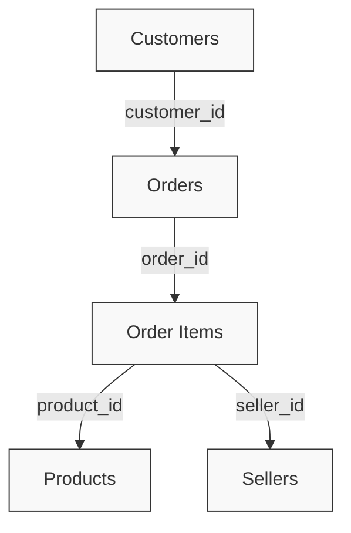
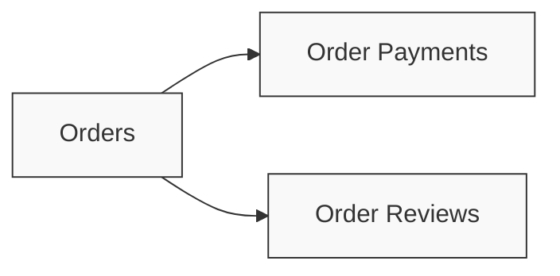

# MLOps Training 2026/2027 — Task 1: Olist Data Ingestion and Database Setup

This repository documents the implementation of Task 1 from the MLOps Training 2026/2027 track. 

The primary objective of this task was to process the raw Olist e-commerce dataset, analyze its relational structure, and ingest it into a PostgreSQL database utilizing Docker. This process establishes a robust data foundation for the subsequent Machine Learning pipeline, which is designed to predict whether an order will be delivered late or on time.

---

## Dataset Overview

The project utilizes the **Brazilian E-Commerce Public Dataset by Olist**, available on [Kaggle](https://www.kaggle.com/datasets/olistbr/brazilian-ecommerce). 

The dataset encompasses comprehensive information regarding customers, orders, products, sellers, payments, reviews, and geographical data, distributed across 9 CSV files:

- `olist_customers_dataset.csv`
- `olist_geolocation_dataset.csv`
- `olist_orders_dataset.csv`
- `olist_order_items_dataset.csv`
- `olist_order_payments_dataset.csv`
- `olist_order_reviews_dataset.csv`
- `olist_products_dataset.csv`
- `olist_sellers_dataset.csv`
- `product_category_name_translation.csv`

*Note: The raw CSV files are excluded from this repository due to file size limitations. To reproduce the environment, please download the dataset from Kaggle and place the files within the `data/raw/` directory.*

---

## Problem Statement

The overarching goal of this MLOps project is to develop a machine learning model capable of classifying order delivery performance into two categories: **Late** or **On Time**. 

The `orders` table contains critical temporal features required for this objective, including `order_purchase_timestamp`, `order_delivered_carrier_date`, `order_delivered_customer_date`, and `order_estimated_delivery_date`. However, the scope of Task 1 is strictly limited to database preparation, schema design, and data validation. Exploratory Data Analysis (EDA) and Machine Learning modeling will be addressed in subsequent tasks.

---

## Technical Infrastructure

Docker was utilized to deploy a local PostgreSQL instance, ensuring environment consistency and reproducibility. The configuration parameters are detailed below:

| Parameter | Configuration |
| :--- | :--- |
| **Database Name** | `olist_db` |
| **Database User** | `olist_user` |
| **PostgreSQL Version** | `16` |
| **Exposed Port** | `5432` |
| **Container Name** | `olist-postgres` |

The container is orchestrated via `docker-compose.yml` and incorporates a named volume (`postgres_data`) to guarantee data persistence across container restarts or removals.

---

## Database Schema Design

The relational schema is defined in `sql/schema.sql`, mapping the 9 CSV files into structured tables with rigorously defined Primary and Foreign Keys.

### Core Entity Relationships

The central entity in the schema is the `orders` table. An order is associated with a single customer but may contain multiple items. Each item links to a specific product and seller.



Furthermore, the `orders` table maintains direct relationships with financial and feedback entities:



### Architectural Design Decisions

During the schema design phase, specific attention was paid to data uniqueness and referential integrity:

1. **Composite Primary Keys:** Implemented for `order_payments` `(order_id, payment_sequential)` and `order_reviews` `(review_id, order_id)`. This was necessary because single identifiers were not strictly unique within the raw dataset.
2. **Geolocation Table:** The `geolocation_zip_code_prefix` attribute exhibits high cardinality and duplication; therefore, it was intentionally excluded from use as a Primary Key.

---

## Data Ingestion and Validation

Following schema creation, the CSV data was ingested into the respective PostgreSQL tables. A row count verification was conducted to ensure data integrity and completeness:

| Table Name | Row Count |
| :--- | ---: |
| `customers` | 99,441 |
| `sellers` | 3,095 |
| `products` | 32,951 |
| `product_category_name_translation` | 71 |
| `orders` | 99,441 |
| `order_items` | 112,650 |
| `order_payments` | 103,886 |
| `order_reviews` | 99,224 |
| `geolocation` | 1,000,163 |

---

## Database Testing and Verification

To validate the operational readiness of the database, a series of SQL queries and integrity checks were executed.

### 1. Order Status Distribution
An initial query verified the distribution of order statuses, confirming that the majority of transactions were successfully fulfilled:

```text
delivered     96,478
shipped        1,107
canceled         625
unavailable      609
invoiced         314
processing       301
created            5
approved           2
```

### 2. Numerical Aggregation Verification
Queries were executed to ensure numerical columns were correctly typed and aggregatable:

```text
Total Product Sales: 13,591,643.70
Total Freight Value:  2,251,909.54
Average Product Price: 120.65
```

### 3. Referential Integrity and JOIN Testing
Core relationships were tested to identify any orphaned records. For instance, the linkage between `orders` and `customers` was validated using a LEFT JOIN:

```sql
SELECT COUNT(*) AS orphan_orders
FROM orders o
LEFT JOIN customers c ON o.customer_id = c.customer_id
WHERE c.customer_id IS NULL;
```
**Result:** `0` orphan orders. This confirms that every order possesses a valid, corresponding customer record. Identical validation tests were successfully applied to the relationships between `order_items`, `products`, and `sellers`.

### 4. Exploratory Query Execution
Additional queries were executed to verify multi-table JOIN capabilities and data consistency:
- **Top Selling Category:** `cama_mesa_banho` (11,115 items sold).
- **Top City by Order Volume:** `sao paulo` (15,540 orders).
- **Dominant Payment Method:** `credit_card` (Highest transaction count and total processed value of 12,542,084.19).

---

## Key Data Insights

The process of structuring the database yielded several critical insights regarding the dataset's architecture:

1. **One-to-Many Cardinality:** The `order_items` table (112,650 rows) exceeds the `orders` table (99,441 rows), confirming that individual orders frequently contain multiple distinct products.
2. **Payment Multiplicity:** A single order may be settled through multiple sequential payment transactions, necessitating the composite primary key in the `order_payments` table.
3. **Review Uniqueness Constraints:** The `review_id` field lacks absolute uniqueness in the raw data, requiring the combination of `(review_id, order_id)` to enforce primary key constraints in the `order_reviews` table.

These observations were instrumental in designing a normalized and robust relational schema, rather than performing a direct, unstructured import of the CSV files.

---

## Project Structure

The repository is organized as follows:

```text
MLOps_Task1/
│
├── data/
│   └── raw/              # Raw CSV files (Excluded from version control)
│
├── sql/
│   └── schema.sql        # Relational database schema and constraints
│
├── docs/                 # Execution screenshots and supplementary reports
│
├── docker-compose.yml    # PostgreSQL container orchestration
├── .gitignore            # Version control exclusion rules
└── README.md             # Project documentation
```

---
